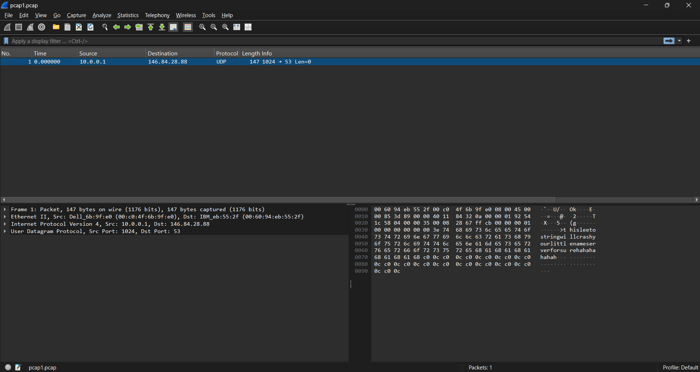
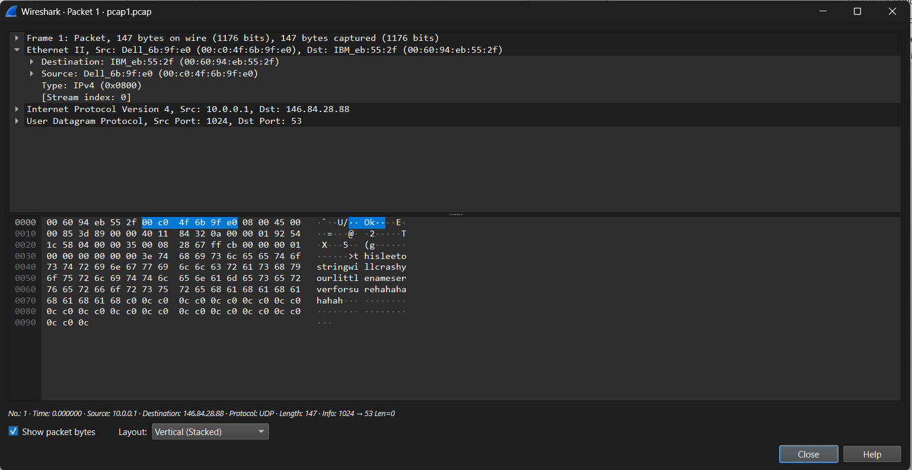
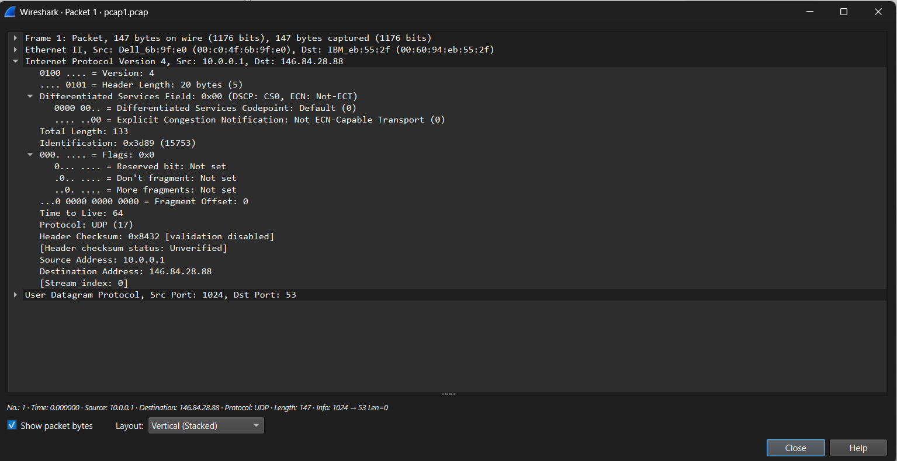
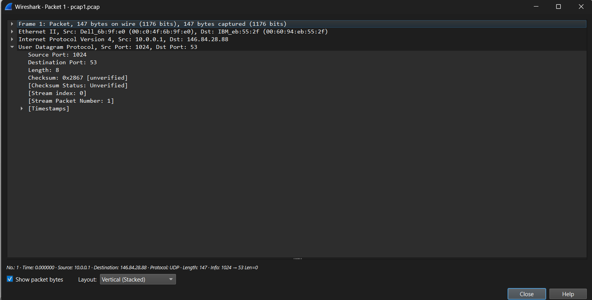
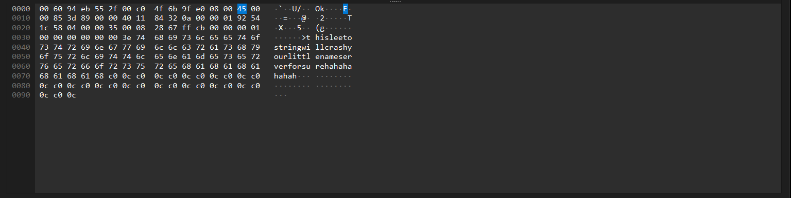
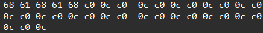

# Tugas KJK - Study Case Serangan IP Services dan Analisis Serangan dengan File PCAP

## Anggota Kelompok
|Nama|NRP|
|---|---|
|Jonathan Steven Tjahjaputra|5027251036|
|Sean Arthur Tamajaya|5027251050|
|Dewa Ngakan Gede Wira Adhimukti|5027251063|

### Study Case

### Analisis Traffic PCAP 1 - DNS Resource Utilization Attacks
Sumber file: https://gitlab.com/wireshark/editor-wiki/-/wikis/uploads/__moin_import__/attachments/SampleCaptures/zlip-3.pcap

Screenshot isi file di dalam Wireshark:

Temuan pertama dan paling mencolok pada packet list adalah kolom Protocol yang menampilkan nilai "UDP", bukan "DNS" seperti yang seharusnya. Dalam kondisi normal, sebuah paket DNS yang valid dan dapat dibaca oleh Wireshark akan teridentifikasi langsung sebagai protokol DNS meskipun menggunakan transport UDP pada port 53. Fakta bahwa Wireshark hanya mampu mengidentifikasinya sebagai UDP menandakan bahwa struktur payload di dalam UDP tersebut tidak sesuai dengan format DNS yang valid.

Setelah mengklik paket dan memperluas bagian Ethernet II pada panel Packet Details  diperoleh informasi berikut:

| Field | Nilai | Penjelasan |
|-------|--------|------------|
| Source MAC | `00:c0:4f:6b:9f:e0` | MAC address perangkat pengirim. |
| Destination MAC | `00:60:94:eb:55:2f` | MAC address gateway/router tujuan. |
| EtherType | `0x0800 (IPv4)` | Frame membawa paket IPv4. |

Pada layer Ethernet, tidak ditemukan anomali. MAC address sumber dan tujuan terbaca dengan normal. `EtherType 0x0800` mengindikasikan bahwa frame ini membawa paket IPv4 di dalamnya, yang merupakan hal yang wajar. Layer ini berfungsi sebagai pembungkus paling luar dari paket dan tidak mengandung tanda-tanda manipulasi.

Bagian Internet Protocol Version 4 pada panel Packet Details menampilkan rincian berikut:

| Field | Nilai | Penjelasan |
|-------|-------|------------|
| Version | `4` | IPv4 |
| Header Length | `20 bytes (IHL=5)` | Header standar tanpa opsi tambahan |
| Total Length | `133 bytes` | Panjang total IP header + payload |
| Identification | `0x3d89 (15753)` | ID unik paket untuk reassembly |
| Flags | `0x00 (tidak ada)` | Tidak ada fragmentasi |
| TTL | `64` | Nilai default Linux/Unix - wajar |
| Protocol | `17 (UDP)` | Menggunakan UDP sebagai transport |
| Checksum | `0x8432` | Checksum IP header (valid) |
| Source IP | `10.0.0.1` | IP privat - perangkat internal penyerang |
| Destination IP | `146.84.28.88` | IP publik - DNS server target serangan |

Pada layer IP, seluruh field tampak dalam kondisi normal dan valid. 

Saat bagian User Datagram Protocol di-expand pada panel Packet Details, terlihat rincian berikut:

| Field | Nilai | Penjelasan |
|-------|-------|------------|
| Source Port | `1024` | Port sumber pengirim (bukan port standar DNS) |
| Destination Port | `53 (domain)` | Port DNS mengarah ke layanan DNS target |
| Length | `8 bytes` | Hanya mencakup header UDP, tidak menghitung payload |
| Checksum | `0x2867` | Checksum UDP (bisa valid atau tidak) |

Pada layer UDP ditemukan dua anomali penting. Pertama, `Destination Port 53` menunjukkan bahwa paket ditujukan ke layanan DNS pada server target, karena port 53 merupakan port standar yang digunakan oleh protokol DNS. Kedua, nilai **UDP Length sebesar 8 bytes terlihat mencurigakan. Nilai tersebut hanya mencakup ukuran header UDP tanpa payload, sedangkan paket sebenarnya memiliki payload DNS sepanjang **113 bytes**. Perbedaan antara nilai Length pada header UDP dan panjang data aktual dapat mengindikasikan adanya manipulasi pada header UDP. Manipulasi tersebut berpotensi digunakan untuk membingungkan sistem analisis jaringan atau IDS/IPS yang melakukan validasi terhadap panjang paket.

Pada bagian terakhir pada panel Packet Details, Wireshark tidak menampilkan layer sebagai Domain Name System (query) seperti yang seharusnya, tetapi hanya mengidentifikasinya sebagai Data atau Padding. Hal ini menunjukkan bahwa Wireshark tidak dapat mem-parsing payload tersebut sebagai paket DNS yang valid. Setelah dilakukan analisis secara manual terhadap raw bytes pada panel Hex Dump, ditemukan struktur sebagai berikut:

| Field | Hex | Nilai | Penjelasan |
|-------|-----|-------|------------|
| Transaction ID | `ff cb` | `0xffcb` | ID unik query DNS |
| Flags | `00 00` | `0x0000` | Standard query, tidak ada flag aktif |
| Questions | `00 01` | `1` | Ada 1 pertanyaan DNS |
| Answer RRs | `00 00` | `0` | Tidak ada jawaban, karena paket merupakan query dan bukan respons |
| Authority RRs | `00 00` | `0` | Tidak ada authority record |
| Additional RRs | `00 00` | `0` | Tidak ada additional record |

Jika dilihat sekilas, header DNS terlihat seperti query DNS pada umumnya, dengan satu pertanyaan, tanpa jawaban, dan flags yang tidak aktif. Namun, bagian yang perlu diperhatikan adalah penggunaan header DNS tersebut sebagai kamuflase. Payload yang mencurigakan justru disisipkan pada bagian **QNAME**, sehingga paket terlihat seperti permintaan DNS biasa meskipun membawa data yang tidak semestinya.

Dalam format DNS (RFC 1035), QNAME adalah nama domain yang ditanyakan. Nama domain ditulis dengan format label: setiap bagian domain diawali dengan 1 byte yang menunjukkan panjang label tersebut, diikuti karakter-karakter label, dan diakhiri dengan byte 0x00 (null terminator). Pada paket ini, bagian QNAME berisi:

| Komponen | Nilai | Analisis |
|----------|-------|----------|
| **Length byte** | `0x3e = 62 byte` | Label sepanjang 62 karakter, tidak lazim untuk domain yang valid|
| **String domain** | `thisleetostringwillcrashyourlittlenameserverforsurehahahahahah` |Bukan domain yang sah, melainkan string provokatif yang diduga dibuat oleh penyerang|

Temuan pada QNAME menjadi salah satu indikator kuat bahwa paket tersebut memiliki tujuan yang tidak wajar. Domain yang umum digunakan, seperti **[www.google.com](http://www.google.com)**, biasanya terdiri dari label yang relatif pendek dan memiliki struktur yang jelas. Sebaliknya, string **thisleetostringwillcrashyourlittlenameserverforsurehahahahahah** terlihat seperti pesan yang sengaja dimasukkan ke dalam QNAME dan bukan nama domain yang normal. Isi string tersebut bahkan secara langsung menyebutkan keinginan untuk menyebabkan nameserver mengalami crash. 

Setelah string QNAME, bagian yang paling berbahaya adalah deretan byte berikut yang terlihat pada panel Hex Dump:

Untuk memahami potensi bahaya pada paket ini, perlu dipahami terlebih dahulu mekanisme **DNS Label Compression** yang didefinisikan dalam RFC 1035. Mekanisme ini merupakan fitur yang valid dalam protokol DNS dan digunakan untuk menghemat ukuran pesan. Ketika sebuah nama domain sudah muncul sebelumnya dalam pesan DNS, nama tersebut dapat direferensikan kembali menggunakan sebuah **pointer** atau penunjuk yang hanya berukuran 2 byte.

Pada mekanisme kompresi DNS, sebuah pointer selalu diawali dengan dua bit bernilai 1, yang umumnya ditunjukkan dengan byte **0xC0**. Dua byte tersebut kemudian diikuti oleh 14 bit yang digunakan untuk menentukan offset atau posisi nama yang dirujuk di dalam pesan DNS. Pada paket ini ditemukan nilai **0xC0 0x0C**, yang berarti pointer mengarah ke offset 12 atau **0x0C** dari awal pesan DNS. Posisi tersebut merupakan awal dari QNAME. Dengan demikian, pointer justru menunjuk kembali ke bagian yang sama, sehingga terjadi **infinite loop** ketika parser mencoba membaca nama domain tersebut.

Ketika DNS server yang rentan mencoba mem-parsing QNAME pada paket ini, parser akan:

1. Membaca label string (62 karakter).
2. Menemukan pointer `0xC00C` -> melompat ke offset 12.
3. Di offset 12 -> menemukan label yang sama -> menemukan pointer `0xC00C` lagi.
4. Proses berulang tanpa henti -> CPU/memori habis -> crash atau hang.

Ditemukannya 15 pointer yang berulang dapat memperkuat efek dari masalah tersebut. Ketika parser mengikuti setiap pointer, parser dapat terjebak dalam siklus yang terus berulang. Parser DNS modern yang telah diperbarui umumnya memiliki batasan terhadap kedalaman pointer, misalnya maksimal 128 lompatan, untuk mencegah kondisi seperti ini. Sementara itu, implementasi DNS lama atau perangkat tertanam yang belum memiliki mekanisme perlindungan tersebut berpotensi mengalami crash secara langsung.

Berikut adalah tampilan lengkap raw bytes dari paket, sebagaimana terlihat pada panel Hex Dump Wireshark, beserta anotasi tiap segmen:

| Offset | Hex | ASCII | Layer / Keterangan |
|--------|-----|-------|--------------------|
| `0000` | `00 60 94 eb 55 2f 00 c0 4f 6b 9f e0 08 00` | `.\`..U/..Ok....` | Ethernet Header (14 byte): Dst+Src MAC, Type `0x0800` |
| `000e` | `45 00 00 85 3d 89 00 00 40 11 84 32 0a 00 00 01 92 54 1c 58` | `E...=...\@..2...T.X` | IP Header (20 byte): Ver4, TTL64, Proto17 (UDP), `10.0.0.1 -> 146.84.28.88` |
| `0022` | `04 00 00 35 00 08 28 67` | `...5..(g` | UDP Header (8 byte): Port `1024 -> 53`, Len=`8` (anomali!), Chk=`0x2867` |
| `002a` | `ff cb 00 00 00 01 00 00 00 00 00 00` | `............` | DNS Header (12 byte): TxID=`0xffcb`, Flags=`0`, Qdcount=`1` |
| `0036` | `3e 74 68 69 73 6c 65 65 74 6f 73 74 72 69 6e 67` | `>thisleeto string` | QNAME: `0x3e=62`, awal string berbahaya |
| `0046` | `77 69 6c 6c 63 72 61 73 68 79 6f 75 72 6c 69 74` | `willcrashy ourlit` | Lanjutan QNAME, string taunting |
| `0056` | `74 6c 65 6e 61 6d 65 73 65 72 76 65 72 66 6f 72` | `tlenameser verfor` | Lanjutan QNAME |
| `0066` | `73 75 72 65 68 61 68 61 68 61 68 61 68 68 c0 0c c0` | `surehahahah...` | Akhir string + awal pointer `C00C` (circular loop) |
| `0076` | `0c c0 0c c0 0c c0 0c c0 0c c0 0c c0 0c c0 0c c0` | `................` | Deretan pointer `C00C` berlanjut (×8 di baris ini) |
| `0086` | `0c c0 0c c0 0c c0 0c c0 0c c0 0c c0 0c c0 0c c0` | `................` | Deretan pointer `C00C` berlanjut |
| `0096` | `0c c0 0c` | `...` | Akhir dari 15 pointer `C00C`, total 30 byte berbahaya |

Berikut adalah ringkasan anomali / red flag yang ada di dalam file:

| # | Indikator | Temuan | Signifikansi |
|---|-----------|--------|--------------|
| 1 | Protokol UDP, bukan DNS | Wireshark tidak melakukan decode sebagai DNS | Payload malformed/rusak dan tidak sesuai dengan format DNS yang valid |
| 2 | UDP Length = 8 anomali | Header UDP menyatakan panjang hanya 8 byte (header saja) | Terdapat ketidakcocokan panjang yang mengindikasikan manipulasi pada header |
| 3 | QNAME string tidak valid | `thisleetostringwillcrash...` (62 karakter) | Bukan domain yang sah dan berisi pesan provokatif dari penyerang |
| 4 | 15× pointer `C00C` berulang | Byte `c0 0c` muncul 15 kali secara berurutan | DNS compression loop yang dapat menyebabkan parser mengalami infinite loop dan berpotensi crash |
| 5 | Tidak ada response paket | File hanya berisi 1 paket dan komunikasi berlangsung satu arah | Menunjukkan adanya query satu arah tanpa respons yang terlihat pada capture |

| Kategori | Detail |
|----------|--------|
| Jenis Serangan | DNS Compression Pointer Loop Attack |
| Kategori (per Materi) | DNS Attacks -> DNS Resource Utilization Attack (DoS) |
| IP Sumber (Penyerang) | `10.0.0.1` (jaringan internal/lokal) |
| IP Tujuan (Target) | `146.84.28.88` port `53` (DNS server eksternal) |
| Dampak | Crash / hang pada DNS server yang tidak ter-patch |
| Referensi RFC | RFC 1035 (DNS), Section 4.1.4 (Message Compression) |
| Tingkat Bahaya | TINGGI, terhadap implementasi DNS yang belum dipatch |

Berdasarkan analisis terhadap file `.pcap` tersebut, dapat disimpulkan bahwa file tersebut berisi satu paket yang mengindikasikan adanya **DNS Compression Pointer Loop**, yaitu teknik Denial of Service (DoS) yang memanfaatkan kelemahan pada parser DNS yang tidak membatasi kedalaman atau pengulangan pointer kompresi. 

Beberapa indikator yang ditemukan mendukung kesimpulan tersebut. Pertama, Wireshark menampilkan protokol sebagai UDP dan tidak melakukan decoding sebagai DNS karena payload memiliki format yang tidak sesuai. Kedua, terdapat ketidaksesuaian antara nilai UDP Length pada header dengan panjang data yang terdapat pada paket. Ketiga, QNAME memiliki panjang 62 karakter dan berisi string yang tidak lazim untuk sebuah nama domain. Keempat, ditemukan 15 compression pointer `0xC00C` yang mengarah kembali ke offset yang sama, sehingga dapat membentuk circular reference dan menyebabkan parser DNS yang rentan mengalami infinite loop.

Serangan tersebut dapat dikategorikan sebagai **DNS Resource Utilization Attack**. Dampak yang mungkin terjadi pada implementasi DNS yang rentan adalah penggunaan sumber daya secara berlebihan hingga menyebabkan nameserver mengalami hang atau crash, terutama jika tidak memiliki mekanisme untuk membatasi circular pointer reference.

### Analisis Traffic PCAP 2 - nama_serangan